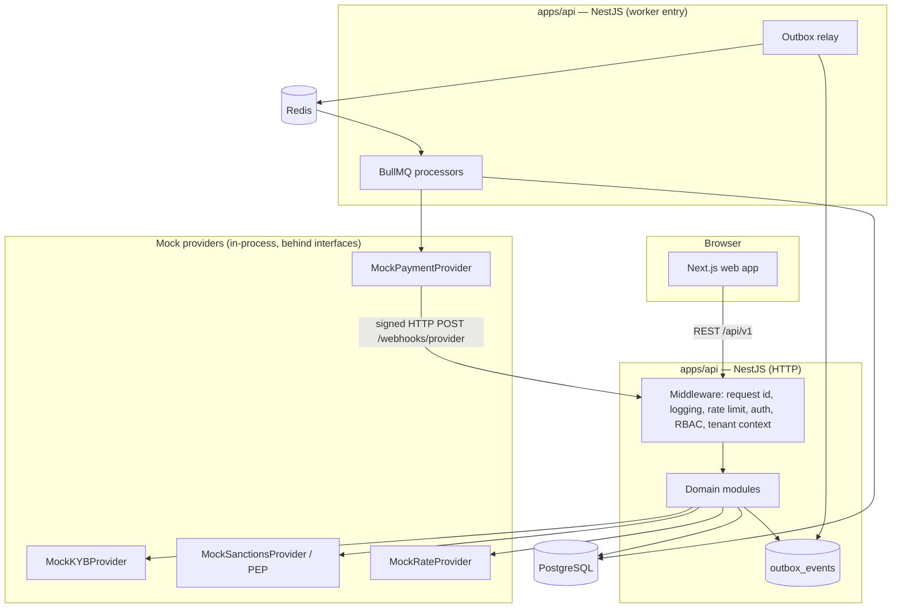
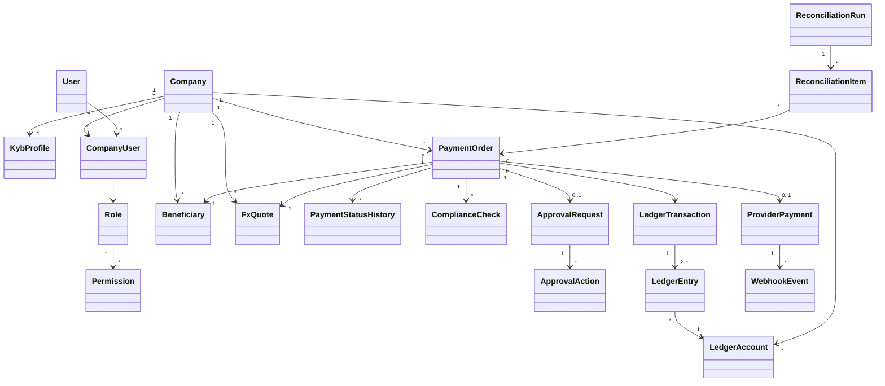
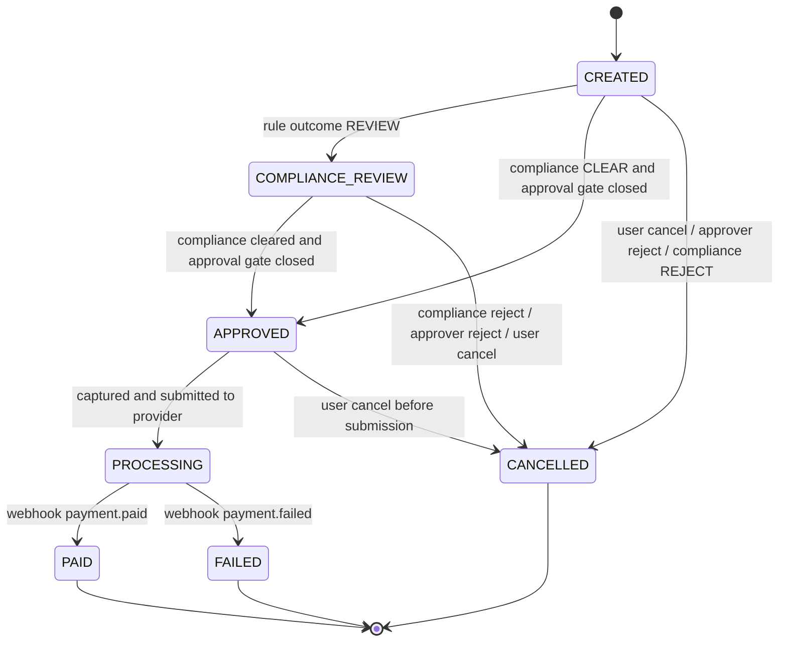
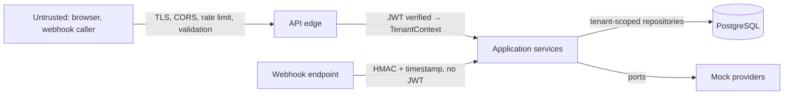

# PayBridge — Architecture

> **Educational Sandbox — No Real Money Movement.**

## 1. System architecture

A modular monolith: one NestJS API process, one worker process (same codebase, different entry point), one Next.js web app, PostgreSQL and Redis. Module boundaries follow the domain so that any module could later be extracted, but a monolith keeps financial writes inside single database transactions — which is the property that matters most here.



## 2. Component diagram (API modules)

| Module | Responsibility | Depends on |
|---|---|---|
| `auth` | Registration, login, tokens, guards | `users`, `audit` |
| `iam` | Roles, permissions, tenant context | — |
| `companies` | Company profile, members | `iam`, `audit` |
| `kyb` | KYB state machine, mock provider | `companies`, `ledger` (account provisioning), `audit` |
| `beneficiaries` | CRUD, validation, encryption, masking | `compliance` (screening), `audit` |
| `fx` | Rate provider, quote engine, quote lifecycle | `kyb`, `audit` |
| `payments` | Payment state machine, creation, cancel | `fx`, `beneficiaries`, `ledger`, `compliance`, `approvals`, `idempotency`, `outbox` |
| `approvals` | Maker-checker | `payments`, `audit` |
| `compliance` | Rules engine, checks, review queue | mock sanctions/PEP, `audit` |
| `ledger` | Accounts, posting, balances | `audit` |
| `provider` | `PaymentProvider` port, mock adapter, `provider_payments` | — |
| `webhooks` | Signature verification, event store, processing | `payments`, `ledger` |
| `reconciliation` | Runs, matching, report | read-only on `payments`, `provider`, `ledger` |
| `audit` | Append-only audit log | — |
| `idempotency` | Idempotency-key store and interceptor | — |
| `outbox` | Transactional outbox and relay | BullMQ |
| `health` | Liveness, readiness | Postgres, Redis |
| `sandbox` | Wallet top-up, provider scenario controls | `ledger` |

Layering inside each module: `controller → application service → domain (state machine, value objects, policies) → repository (Prisma)`. Controllers do transport only. Domain code has no framework imports. Providers are ports (interfaces) with adapters, bound by a DI token chosen from configuration.

## 3. Domain model



Aggregates and their consistency boundaries:

- **PaymentOrder** (root) with status history, compliance checks, approval request. All transitions go through `PaymentStateMachine`.
- **FxQuote** — immutable value-like aggregate; only `status` changes.
- **LedgerTransaction** with its entries — written once.
- **Company** with KYB profile and members.

Value objects: `Money(amount, currency)`, `FxRate`, `Ifsc`, `MaskedAccountNumber`, `TenantContext(userId, companyId, role, permissions)`.

## 4. Data flow — payment creation

```mermaid
sequenceDiagram
  participant C as Client
  participant A as API
  participant DB as PostgreSQL
  participant O as Outbox relay
  participant Q as BullMQ
  C->>A: POST /payments (Idempotency-Key)
  A->>DB: BEGIN
  A->>DB: insert idempotency_keys (IN_PROGRESS) — unique
  A->>DB: SELECT quote FOR UPDATE; validate owner/status/expiry
  A->>DB: validate KYB, beneficiary
  A->>A: run compliance rules
  A->>DB: quote → USED; insert payment, history, checks, approval_request
  A->>DB: post PAYMENT_HOLD (locks wallet; INSUFFICIENT_FUNDS aborts all)
  A->>DB: insert audit_logs, outbox_events
  A->>DB: store response in idempotency_keys (COMPLETED); COMMIT
  A-->>C: 201 payment
  O->>DB: poll outbox (SKIP LOCKED)
  O->>Q: enqueue job (jobId = outbox id)
```

## 5. Event and webhook architecture

### 5.1 Transactional outbox
State changes that need follow-up work write a row to `outbox_events` in the same transaction. The relay (in the worker) polls with `FOR UPDATE SKIP LOCKED`, enqueues to BullMQ using the outbox id as `jobId` (so a re-publish is de-duplicated), then marks the row published. If Redis is down the API keeps accepting payments; work drains when Redis returns.

### 5.2 Queues and jobs

| Queue | Job | Trigger | Idempotency |
|---|---|---|---|
| `payments` | `ProcessPayment` | `payment.approved` outbox event | State guard `APPROVED → PROCESSING`; capture posting key |
| `payments` | `RetryFailedProviderRequest` | Provider submission error | Provider idempotency key = payment id |
| `webhooks` | `ProcessWebhooks` | Webhook stored | `webhook_events.status`; ledger posting key |
| `compliance` | `RunComplianceChecks` | Re-screen request, provider timeout | Check rows keyed by (payment, rule, run) |
| `quotes` | `ExpireQuotes` | Repeatable, every 15 s | `UPDATE … WHERE status = ACTIVE AND expires_at < now()` |
| `reconciliation` | `RunReconciliation` | Repeatable hourly, or manual | New run row each time |

Retry policy: 5 attempts, exponential backoff starting at 2 s with jitter (2, 4, 8, 16, 32 s). **Dead-letter handling:** a job that exhausts its attempts stays in BullMQ's failed set and a `failed` listener copies it into a `dead-letter` queue with the original payload, error and attempt count; an admin endpoint lists and re-drives them. A dead-lettered `ProcessPayment` leaves the payment in its current state — it is never auto-failed, because the provider's state is unknown — and reconciliation surfaces it as `REVIEW_REQUIRED`.

### 5.3 Webhook handling

```mermaid
sequenceDiagram
  participant P as Mock provider
  participant A as API /webhooks/provider
  participant DB as PostgreSQL
  participant W as Worker
  P->>A: POST event (X-PayBridge-Signature: t=…,v1=…)
  A->>A: verify HMAC over "t.rawBody", |now − t| ≤ 300 s
  A->>DB: INSERT webhook_events (event_id UNIQUE) ON CONFLICT DO NOTHING
  alt already seen
    A-->>P: 200 (duplicate)
  else new
    A->>DB: outbox: webhook.received
    A-->>P: 200
    W->>DB: BEGIN; lock payment FOR UPDATE
    W->>W: state machine: is this transition legal from current state?
    alt legal
      W->>DB: update status, history, ledger posting, audit
      W->>DB: webhook_events → PROCESSED
    else stale / out of order
      W->>DB: webhook_events → IGNORED (reason)
    end
    W->>DB: COMMIT
  end
```

Three independent defences give exactly-once financial effect: the unique `event_id`, the state-machine guard under a row lock, and the unique ledger `posting_key`. Any one of them alone would prevent a double posting.

Ordering: events carry the provider's `timestamp` and a per-payment `sequence`. The handler does not require order; it applies an event only if the implied transition is legal. `payment.processing` after `PAID` is ignored. `payment.failed` after `PAID` (or the reverse) is ignored **and** logged at error level; reconciliation then reports the disagreement.

## 6. State machines

Implemented as pure transition tables in `packages/shared`; services call `assertTransition(from, to)` and nothing else may write a status column.

### 6.1 Payment



Gates (orthogonal fields on the payment):

- `compliance_status`: `CLEAR | REVIEW | REJECT`, then `CLEARED_BY_ADMIN` or `REJECTED_BY_ADMIN` after a decision.
- `approval_status`: `NOT_REQUIRED | PENDING | APPROVED | REJECTED`.

`→ APPROVED` fires when `compliance_status ∈ {CLEAR, CLEARED_BY_ADMIN}` **and** `approval_status ∈ {NOT_REQUIRED, APPROVED}`. Whichever gate closes last triggers the transition.

**Forbidden:** any transition out of `PAID`, `FAILED`, `CANCELLED`; `PROCESSING → CANCELLED`; `CREATED → PROCESSING`; `COMPLIANCE_REVIEW → PROCESSING`; anything backwards.

### 6.2 KYB

| From | To | Trigger |
|---|---|---|
| `DRAFT` | `SUBMITTED` | Company admin submits |
| `SUBMITTED` | `UNDER_REVIEW` | Mock provider result stored |
| `UNDER_REVIEW` | `APPROVED` | Platform admin approves |
| `UNDER_REVIEW` | `REJECTED` | Platform admin rejects (reason required) |
| `REJECTED` | `DRAFT` | Company admin edits to resubmit |
| `APPROVED` | `EXPIRED` | Trade licence expiry passed |
| `EXPIRED` | `DRAFT` | Company admin renews details |

Forbidden: `DRAFT → APPROVED`, `SUBMITTED → APPROVED` (review cannot be skipped), `APPROVED → REJECTED` (use a new review cycle), anything out of `APPROVED` except `EXPIRED`.

### 6.3 Quote

| From | To | Trigger |
|---|---|---|
| `ACTIVE` | `USED` | Payment created from it |
| `ACTIVE` | `EXPIRED` | `expires_at` passed |
| `ACTIVE` | `CANCELLED` | Compliance rejected the payment at creation, or user discards |

All three targets are terminal. A quote past `expires_at` is treated as expired regardless of its stored status.

### 6.4 Webhook event
`RECEIVED → PROCESSED | IGNORED | FAILED`; `FAILED → PROCESSED` on retry.

## 7. External provider abstraction

```ts
interface PaymentProvider {
  createPayment(req: CreateProviderPayment): Promise<ProviderPayment>;   // idempotent on req.idempotencyKey
  getPaymentStatus(providerPaymentId: string): Promise<ProviderPaymentStatus>;
  listPayments(period: DateRange): Promise<ProviderPayment[]>;            // statement feed for reconciliation
}
interface KybProvider       { verify(company: KybSubject): Promise<KybVerification>; }
interface SanctionsProvider { screen(subject: ScreeningSubject): Promise<ScreeningResult>; }  // CLEAR | MATCH | PEP_MATCH
interface RateProvider      { getMidRate(base: Currency, quote: Currency): Promise<FxRate>; }
```

Mock adapters are deterministic and driven by test tokens in the input (COMPLIANCE.md §6, and beneficiary-name or amount triggers for provider scenarios such as `TEST-FAIL`, `TEST-TIMEOUT`, `TEST-DUPLICATE-WEBHOOK`, `TEST-OUT-OF-ORDER`). The mock payment provider keeps its own records in `provider_payments` and delivers webhooks over real HTTP to the API with a real signature, so the webhook path is exercised exactly as it would be with an external provider. No adapter for a real provider exists or is planned.

## 8. Security boundaries



- **Edge:** all input validated by DTO schemas with unknown properties rejected.
- **Identity → tenant:** `TenantContext` is built once per request from the verified token and membership lookup; repositories require it as an argument, so an unscoped tenant query cannot be written by accident.
- **Webhook boundary:** authenticated by signature only; has no user context and can only invoke the webhook use case.
- **Data:** application DB role has no `UPDATE`/`DELETE` on ledger and audit tables (triggers back this up). Details in SECURITY.md.

## 9. Failure handling

| Failure | Behaviour |
|---|---|
| Database down | Requests fail `503 SERVICE_UNAVAILABLE`; readiness fails; nothing is partially written |
| Redis down | API serves; outbox accumulates; readiness reports degraded; rate limiter falls back to in-memory |
| Provider timeout | Job retries with the same idempotency key; then dead-letter; payment stays `PROCESSING` |
| Duplicate webhook | 200, no effect |
| Out-of-order webhook | Applied only if legal; else `IGNORED` |
| Ledger posting failure | Enclosing transaction rolls back; error surfaces as `LEDGER_IMBALANCE` or `INSUFFICIENT_FUNDS` |
| Unexpected exception | Global filter returns the standard error envelope with `INTERNAL_ERROR` and request id; full error logged; never swallowed |

## 10. Project structure

```
paybridge/
├── apps/
│   ├── api/                       NestJS
│   │   ├── src/
│   │   │   ├── main.ts            HTTP entry
│   │   │   ├── worker.ts          BullMQ entry
│   │   │   ├── common/            filters, interceptors, guards, decorators, logger
│   │   │   ├── config/            typed, validated env config
│   │   │   └── modules/
│   │   │       ├── auth/  iam/  companies/  kyb/  beneficiaries/  fx/
│   │   │       ├── payments/  approvals/  compliance/  ledger/
│   │   │       ├── provider/  webhooks/  reconciliation/
│   │   │       └── audit/  idempotency/  outbox/  health/  sandbox/
│   │   │           └── <module>/{*.controller,*.service,*.repository,dto/,domain/,*.spec}.ts
│   │   └── test/                  integration + invariant suites (Supertest)
│   └── web/                       Next.js App Router
│       ├── src/app/               routes per brief §22
│       ├── src/components/        badges, tables, timelines, wizard, countdown
│       ├── src/lib/               api client, query hooks, zod schemas, money formatting
│       └── e2e/                   Playwright
├── packages/
│   ├── database/                  Prisma schema, migrations, seed, raw SQL (triggers, checks)
│   ├── shared/                    Money, state machines, error codes, permissions
│   ├── types/                     API contracts shared by web and api
│   └── config/                    eslint, tsconfig, jest presets
├── infra/
│   ├── docker/                    Dockerfiles
│   └── scripts/                   wait-for, migrate-and-seed
├── docs/
├── .github/workflows/ci.yml
├── docker-compose.yml
├── .env.example
└── README.md
```

Tooling: pnpm workspaces + Turborepo, TypeScript strict, ESLint, Prettier.
