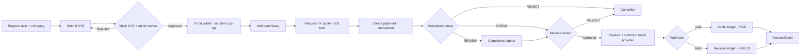

# PayBridge — Business Requirements Document

> **Educational Sandbox — No Real Money Movement.** Not a licensed financial product. No regulatory compliance is claimed.

## 1. Executive summary

PayBridge is a simulated cross-border payments platform that models how a UAE-based SME would pay an Indian supplier: the SME holds an AED balance, locks an FX quote, and instructs a payout in INR. Every external dependency (KYB, sanctions, rates, payout rail) is a deterministic mock. The purpose is to demonstrate, end to end, the engineering that makes payment systems trustworthy: double-entry accounting, idempotency, explicit state machines, compliance gating, exactly-once webhook handling, reconciliation and auditability.

## 2. Business problem

UAE SMEs importing from India typically pay through bank wires with opaque FX margins, unpredictable fees, slow settlement and little status visibility. A purpose-built platform would give them upfront pricing, a locked rate, internal approval controls and a traceable payment.

For this project the "business" is educational: there is no widely available reference implementation that shows the *whole* lifecycle with financial-grade correctness. PayBridge fills that gap as a portfolio and learning artefact.

## 3. Business objectives

| # | Objective | Measure |
|---|---|---|
| O1 | Demonstrate a complete payment lifecycle | The 21-step demo scenario runs unaided from a clean `docker compose up` |
| O2 | Demonstrate financial correctness | Zero unbalanced ledger transactions; all eight financial invariants covered by automated tests |
| O3 | Demonstrate operational safety | Duplicate requests and duplicate webhooks produce no duplicate financial effect |
| O4 | Demonstrate control and oversight | Every state change is attributable to an actor in an immutable audit log |
| O5 | Remain unmistakably a simulation | Sandbox banner on every page and in every API response header; no real provider integrations |

## 4. Target users

| User | Organisation | Goal |
|---|---|---|
| SME Admin | Customer company | Onboard the company, manage users, oversee payments |
| SME Maker | Customer company | Prepare beneficiaries, quotes and payment instructions |
| SME Approver | Customer company | Approve or reject payments (four-eyes control) |
| SME Viewer | Customer company | Read-only visibility |
| Platform Admin | PayBridge operations | KYB review, compliance decisions, ledger, reconciliation, audit |

## 5. Stakeholders

Project author (owner, engineer), reviewers of the portfolio (hiring managers, senior engineers), and the simulated personas above. There are no real customers, regulators or banking partners.

## 6. Scope

**In scope**

- Company registration and KYB with a mock verification provider
- User management with role-based access control and tenant isolation
- Indian beneficiary management with validation, masking and encryption
- AED → INR quoting with spread, flat fee and a 60-second lock
- Payment orders with idempotent creation, maker-checker and a compliance gate
- Double-entry ledger with holds, capture, settlement and reversal
- Mock payout provider, signed webhooks, exactly-once processing
- Three-way reconciliation (payment ↔ provider ↔ ledger)
- Immutable audit log, structured logging, health endpoints
- Web dashboard, OpenAPI documentation, CI, Docker Compose

**Out of scope**

- Any real movement of money, real bank or card connectivity, real remittance
- Real KYC/KYB, sanctions or PEP data sources
- Storage of real identity documents or real financial credentials
- Corridors other than AED → INR; customer-held INR balances
- Regulatory reporting (goAML, CBUAE, RBI/FEMA returns)
- Mobile apps, SSO, MFA (noted as P2), chargebacks, interest, invoicing

## 7. Business workflows

## 8. Business rules

| ID | Rule |
|---|---|
| BR-01 | A company may transact only while its KYB status is `APPROVED`. |
| BR-02 | A beneficiary belongs to exactly one company and must be in India (`IN`) with a valid IFSC. |
| BR-03 | A quote is valid for 60 seconds, is immutable once issued, and can fund at most one payment. |
| BR-04 | The customer is debited `base_amount + fee`. The beneficiary receives `floor(base_amount × customer_rate, 2)` INR. |
| BR-05 | A payment cannot be created unless the wallet's available balance covers the total debit. |
| BR-06 | Funds are held at creation, captured at processing, and returned in full (including fee) on failure or cancellation. |
| BR-07 | A payment above the configured threshold, breaching the velocity limit, or matching a watch-list is not processed without a compliance decision. |
| BR-08 | Where maker-checker is enabled, the creator of a payment cannot approve it. |
| BR-09 | Every financial event is a balanced double-entry transaction. Ledger and audit records are never edited or deleted. |
| BR-10 | The same request (by `Idempotency-Key`) or provider event (by `event_id`) has a financial effect at most once. |
| BR-11 | A company's users can see only that company's data. Platform admins can see all tenants. |
| BR-12 | Every page and API response identifies the system as a sandbox. |

## 9. Success metrics

- Demo scenario completes with reconciliation result `MATCHED`.
- 100 % of mandatory financial invariants (PRD §8) pass in CI.
- Ledger trial balance is zero per currency after any test run.
- Cross-tenant access tests: 0 leaks across all tenant-scoped endpoints.
- Clean start to working app in one command; CI green on lint, typecheck, unit, integration, build.

## 10. Risks

| Risk | Impact | Mitigation |
|---|---|---|
| Mistaken for a real payment product | High | Persistent sandbox labelling, no real integrations, fictional seed data, no financial branding |
| Scope overrun | Medium | Phased delivery, P0/P1/P2 backlog, demo scenario as the P0 definition |
| Accounting model is wrong or unconvincing | High | Documented assumptions in LEDGER.md, invariant tests, trial balance check |
| Hidden concurrency bugs | High | Row locks, unique constraints, concurrency tests for quote/idempotency/webhook |
| Simulated compliance read as real | Medium | COMPLIANCE.md states clearly what is and is not modelled |

## 11. Assumptions

See [00-REQUIREMENTS-ANALYSIS.md](00-REQUIREMENTS-ANALYSIS.md) §1 and §6. The two with the largest business effect: the fee is charged on top of the send amount (A1), and compliance and maker-checker are independent gates before `APPROVED` (A2).
