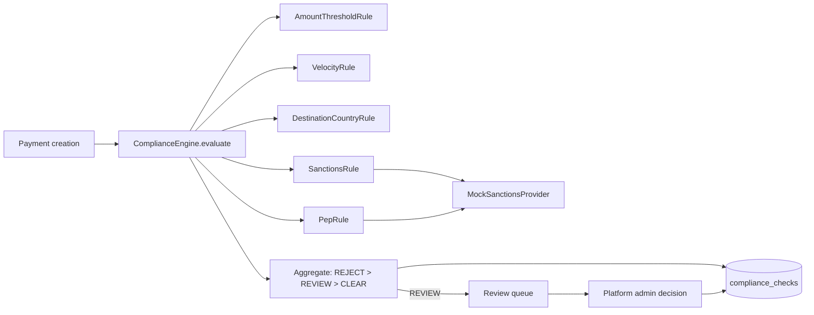
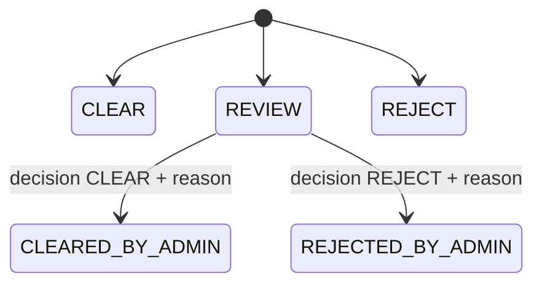

# PayBridge — Compliance Architecture

> **Educational Sandbox — No Real Money Movement.** Everything here is a simulation of compliance *workflows*. It uses no real watch-lists, verifies no real identity, and does not make the system compliant with any AML/CFT regime. It must never be used to screen real people or companies.

## 1. What is modelled and what is not

| Modelled | Not modelled |
|---|---|
| The *shape* of KYB, screening and transaction monitoring | Real registry lookups, UBO identification, document verification |
| Deterministic rule outcomes and a human review queue | Real sanctions/PEP lists, fuzzy name matching, list updates |
| Decision logging and auditability | Regulatory reporting (STR/SAR, goAML), record-retention law |
| Blocking a payment until a decision exists | Ongoing monitoring, risk scoring models, travel rule |

## 2. Components



- `ComplianceEngine` loads enabled `compliance_rules`, builds an immutable `ComplianceContext` (payment, company, beneficiary, recent activity) and runs each rule.
- Each rule is a class implementing `evaluate(ctx, params) → { triggered, outcome, details }`. Rules are pure with respect to the context: no rule performs its own database writes.
- The engine writes one `compliance_checks` row per rule — including rules that did **not** fire, so the record shows what was checked, not only what failed.

## 3. Rules

Rules are rows in `compliance_rules`; `parameters` is validated against a per-type schema. Changing a rule bumps its `version`, and each check stores the version it was evaluated under.

| Code | Type | Default parameters | Fires when | Default outcome |
|---|---|---|---|---|
| `AMOUNT_THRESHOLD` | `AMOUNT_THRESHOLD` | `{ "currency": "AED", "threshold": "50000.00" }` | `source_amount > threshold` | `REVIEW` |
| `VELOCITY_24H` | `VELOCITY` | `{ "maxCount": 5, "windowHours": 24 }` | company already has `maxCount` or more non-cancelled payments in the window | `REVIEW` |
| `DESTINATION_COUNTRY` | `DESTINATION_COUNTRY` | `{ "allowed": ["IN"] }` | beneficiary country not in `allowed` | `REJECT` |
| `SANCTIONS_SCREEN` | `SANCTIONS` | `{ "subjects": ["beneficiary", "company"] }` | provider returns `MATCH` | `REJECT` |
| `PEP_SCREEN` | `PEP` | `{ "subjects": ["beneficiary"] }` | provider returns `PEP_MATCH` | `REVIEW` |

Velocity counts payments created in the window by `created_at`, excluding `CANCELLED`; the payment being evaluated is not counted, so the sixth payment within 24 hours is the first to be flagged.

## 4. Result aggregation and effect on the payment

```
any rule outcome REJECT  → REJECT
else any REVIEW          → REVIEW
else                     → CLEAR
```

| Result | `compliance_status` | Payment status | Ledger |
|---|---|---|---|
| `CLEAR` | `CLEAR` | stays `CREATED` (awaiting approval) or → `APPROVED` | Hold posted |
| `REVIEW` | `REVIEW` | → `COMPLIANCE_REVIEW` | Hold posted |
| `REJECT` | `REJECT` | → `CANCELLED` (`COMPLIANCE_REJECTED`) | Nothing posted; quote → `CANCELLED` |

## 5. Compliance states and review



- The queue (`GET /admin/compliance-queue`) lists payments with `compliance_status = REVIEW`, oldest first, with the rules that fired.
- A decision requires `compliance.review` (platform admin only) and a free-text reason. It writes a `compliance_checks` row with `rule_code = MANUAL_DECISION`, `decided_by` and the note, plus an audit record.
- `CLEAR` closes the compliance gate; the payment becomes `APPROVED` once the maker-checker gate is also closed. `REJECT` cancels the payment and releases the hold.
- SME users with `compliance.read` see which rules fired on their own payments, with screening details reduced to the outcome (no provider internals).
- A decision cannot be changed. Reopening would require a new payment.

## 6. Mock providers — deterministic behaviour

Matching is case-insensitive substring on the screened name.

| Input contains | `MockSanctionsProvider.screen` returns |
|---|---|
| `TEST-SANCTION` | `MATCH` |
| `TEST-PEP` | `PEP_MATCH` |
| `TEST-SCREEN-TIMEOUT` | throws `ProviderTimeoutError`; the engine fails safe and holds the payment for `REVIEW` |
| anything else | `CLEAR` |

| Company name / licence contains | `MockKYBProvider.verify` returns |
|---|---|
| `TEST-KYB-REJECT` | `{ result: "FAIL", riskLevel: "HIGH", reasons: ["MOCK_REGISTRY_MISMATCH"] }` |
| `TEST-KYB-HIGHRISK` | `{ result: "PASS", riskLevel: "HIGH" }` |
| anything else | `{ result: "PASS", riskLevel: "LOW" }` |

The mock result is advisory. A platform admin always makes the KYB decision; a config flag `KYB_AUTO_APPROVE=true` (off by default) auto-approves `PASS`/`LOW` results ("Mock KYB approves company").

## 7. KYB simulation

State machine in ARCHITECTURE.md §6.2. On submission the engine stores the provider's response in `kyb_profiles.verification_result` and the suggested `risk_level`. Approval provisions the company's wallet and hold accounts. Until `APPROVED`, quoting and payment creation return `KYB_NOT_APPROVED`. Beneficiaries may be prepared earlier.

## 8. Screening at beneficiary creation

The beneficiary name and account holder name are screened when the beneficiary is created or renamed. `MATCH` → status `BLOCKED` (cannot be paid, visible to platform admin). `PEP_MATCH` → stays `ACTIVE` but every payment to them goes to review. The same screening runs again at payment time, since list membership can change between the two.

## 9. Logging

Every evaluation, every rule outcome and every decision is persisted in `compliance_checks` and mirrored to `audit_logs` (`COMPLIANCE_CHECKED`, `COMPLIANCE_FLAGGED`, `COMPLIANCE_CLEARED`, `COMPLIANCE_REJECTED`). Nothing in the compliance path is deleted or overwritten.
