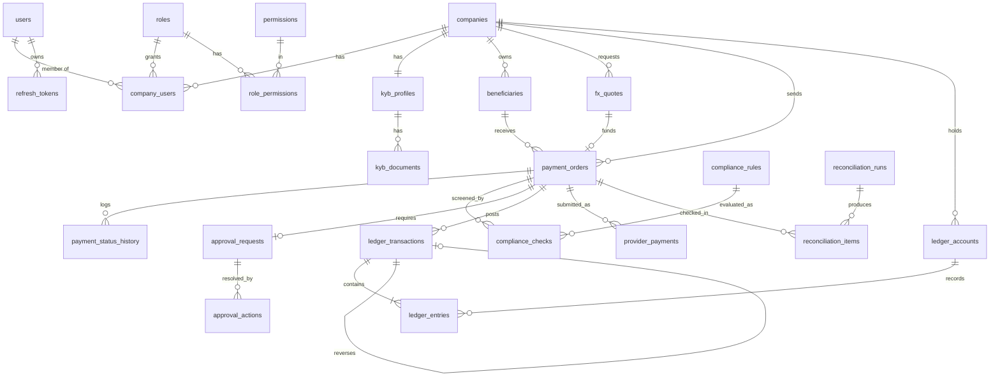

# PayBridge — Database Design

> **Educational Sandbox — No Real Money Movement.**

PostgreSQL 16, Prisma ORM. The schema proposal is [packages/database/prisma/schema.prisma](../packages/database/prisma/schema.prisma); it passes `prisma validate`. Migrations are generated in Phase 1 onward, one per phase, with the raw SQL in §5 added by hand to the relevant migration.

## 1. Entity relationship diagram



`audit_logs`, `webhook_events`, `idempotency_keys` and `outbox_events` deliberately have no foreign keys (see §4).

## 2. Tables

| Table | Purpose | Tenant-scoped | Mutable |
|---|---|:-:|---|
| `users` | Login identities | — | Yes |
| `roles`, `permissions`, `role_permissions` | RBAC catalogue (seeded) | — | Seed only |
| `company_users` | Membership and role within a company | ✓ | Yes |
| `refresh_tokens` | Hashed rotating refresh tokens | — | Revoke only |
| `companies` | Tenant root | ✓ (is the tenant) | Restricted after KYB |
| `kyb_profiles`, `kyb_documents` | KYB state and document metadata | ✓ | Via state machine |
| `beneficiaries` | Indian payees, encrypted account number | ✓ | Name/status only after first use |
| `fx_quotes` | Locked quotes | ✓ | `status`, `used_at` only |
| `payment_orders` | Payment instructions | ✓ | Status fields only |
| `payment_status_history` | One row per transition | ✓ (via payment) | Append-only |
| `compliance_rules` | Rule configuration | — | Platform admin; versioned |
| `compliance_checks` | One row per rule evaluation or decision | ✓ | Append-only |
| `approval_requests`, `approval_actions` | Maker-checker | ✓ | Request status only; actions append-only |
| `ledger_accounts` | Chart of accounts, cached balance | ✓ / system | `balance`, `version` via posting only |
| `ledger_transactions`, `ledger_entries` | Double-entry journal | ✓ / system | **Immutable** |
| `provider_payments` | Mock provider's own records | — | Mock provider only |
| `webhook_events` | Inbound provider events | — | Processing fields only |
| `reconciliation_runs`, `reconciliation_items` | Reconciliation output | items carry `company_id` | Append-only after completion |
| `audit_logs` | Audit trail | ✓ | **Immutable** |
| `idempotency_keys` | Request de-duplication | ✓ | Until completed; purged after expiry |
| `outbox_events` | Transactional outbox | — | Publish status only |

Added beyond the brief's list: `refresh_tokens`, `provider_payments`, `idempotency_keys`, `outbox_events` (reasons in 00-REQUIREMENTS-ANALYSIS.md §2).

## 3. Relationships and constraints

**Keys.** All primary keys are UUIDv7 (time-ordered, index-friendly, non-enumerable). Payments also carry a human-readable `reference`.

**Tenant-safe foreign keys.** `payment_orders (beneficiary_id, company_id) → beneficiaries (id, company_id)` and `payment_orders (quote_id, company_id) → fx_quotes (id, company_id)`. A payment therefore *cannot* reference another tenant's beneficiary or quote even if application checks were bypassed.

**Uniqueness that carries business rules**

| Constraint | Rule enforced |
|---|---|
| `payment_orders.quote_id UNIQUE` | A quote funds at most one payment |
| `payment_orders (company_id, idempotency_key) UNIQUE` | No duplicate payment per key |
| `idempotency_keys (company_id, key) UNIQUE` | Concurrent duplicate requests serialise |
| `webhook_events.event_id UNIQUE` | Each provider event stored once |
| `ledger_transactions.posting_key UNIQUE` | Each ledger step posted once |
| `ledger_transactions.reverses_transaction_id UNIQUE` | A transaction is reversed at most once |
| `approval_requests.payment_id UNIQUE` | One approval request per payment |
| `beneficiaries (company_id, account_fingerprint) UNIQUE` | No duplicate beneficiary |
| `companies.trade_license_number UNIQUE` | No duplicate company |
| `ledger_entries (account_id, currency) → ledger_accounts (id, currency)` | Entry currency equals account currency |

**Delete behaviour.** `ON DELETE RESTRICT` everywhere except `role_permissions` and `refresh_tokens`. Business rows are deactivated, not deleted.

## 4. Indexes

Every table with `company_id` has a composite index leading with it, because every tenant query filters on it first.

| Table | Index | Serves |
|---|---|---|
| `payment_orders` | `(company_id, status)`, `(company_id, created_at)`, `(status, created_at)`, `(beneficiary_id)`, unique `(quote_id)`, unique `(company_id, idempotency_key)`, unique `(provider_payment_id)` | Lists, queues, lookups |
| `fx_quotes` | `(company_id, created_at)`, `(status, expires_at)` | History, expiry sweep |
| `beneficiaries` | `(company_id, status)`, `(company_id, created_at)` | Lists |
| `ledger_entries` | `(transaction_id)`, `(account_id, created_at)` | Statement, balance proof |
| `ledger_transactions` | `(payment_id)`, `(company_id, created_at)`, `(type, created_at)` | Payment detail, reports |
| `compliance_checks` | `(payment_id)`, `(company_id, created_at)`, `(outcome)` | Detail, queue |
| `webhook_events` | unique `(event_id)`, `(payment_id)`, `(status, received_at)` | Dedupe, retry sweep |
| `reconciliation_items` | `(run_id, status)`, `(payment_id)`, `(company_id, created_at)` | Report filters |
| `audit_logs` | `(company_id, created_at)`, `(entity_type, entity_id)`, `(user_id, created_at)`, `(action, created_at)` | Timelines |
| `outbox_events` | `(status, created_at)` | Relay polling |
| `idempotency_keys` | `(expires_at)` | Purge |

`audit_logs`, `webhook_events`, `idempotency_keys` and `outbox_events` have no foreign keys: audit rows must survive anything and must never block a business write; webhook events must be storable even when they reference an unknown payment.

## 5. Raw SQL beyond Prisma

Added by hand to migrations (Prisma cannot express them):

```sql
CREATE EXTENSION IF NOT EXISTS citext;

-- Amounts
ALTER TABLE ledger_entries   ADD CONSTRAINT ledger_entries_amount_positive CHECK (amount > 0);
ALTER TABLE fx_quotes        ADD CONSTRAINT fx_quotes_amounts_positive
  CHECK (base_amount > 0 AND recipient_amount > 0 AND fee_amount >= 0 AND customer_rate > 0);
ALTER TABLE fx_quotes        ADD CONSTRAINT fx_quotes_expiry_after_creation CHECK (expires_at > created_at);
ALTER TABLE payment_orders   ADD CONSTRAINT payment_orders_total CHECK (total_debit_amount = source_amount + fee_amount);

-- Customer accounts can never go negative
ALTER TABLE ledger_accounts  ADD CONSTRAINT ledger_accounts_customer_non_negative
  CHECK (company_id IS NULL OR balance >= 0);

-- System accounts: one per code
CREATE UNIQUE INDEX ledger_accounts_system_code ON ledger_accounts (code) WHERE company_id IS NULL;

-- Immutability
CREATE FUNCTION forbid_mutation() RETURNS trigger AS $$
BEGIN RAISE EXCEPTION '% on % is not permitted', TG_OP, TG_TABLE_NAME; END $$ LANGUAGE plpgsql;

CREATE TRIGGER ledger_entries_immutable      BEFORE UPDATE OR DELETE ON ledger_entries      FOR EACH ROW EXECUTE FUNCTION forbid_mutation();
CREATE TRIGGER ledger_transactions_immutable BEFORE UPDATE OR DELETE ON ledger_transactions FOR EACH ROW EXECUTE FUNCTION forbid_mutation();
CREATE TRIGGER audit_logs_immutable          BEFORE UPDATE OR DELETE ON audit_logs          FOR EACH ROW EXECUTE FUNCTION forbid_mutation();
-- fx_quotes: a trigger that raises if any priced column differs between OLD and NEW.

-- Balanced transactions, checked at COMMIT
CREATE FUNCTION assert_ledger_balanced() RETURNS trigger AS $$
BEGIN
  IF EXISTS (
    SELECT 1 FROM ledger_entries
    WHERE transaction_id = NEW.transaction_id
    GROUP BY currency
    HAVING SUM(CASE direction WHEN 'DEBIT' THEN amount ELSE -amount END) <> 0
  ) THEN RAISE EXCEPTION 'LEDGER_IMBALANCE: transaction %', NEW.transaction_id; END IF;
  RETURN NULL;
END $$ LANGUAGE plpgsql;

CREATE CONSTRAINT TRIGGER ledger_entries_balanced
  AFTER INSERT ON ledger_entries DEFERRABLE INITIALLY DEFERRED
  FOR EACH ROW EXECUTE FUNCTION assert_ledger_balanced();
```

P1 defence in depth: a separate DB role for the application with `INSERT, SELECT` only on `ledger_*` and `audit_logs`, and Postgres row-level security keyed on a `SET LOCAL app.company_id` set at the start of each tenant transaction.

## 6. Money precision

| Kind | Column type | Notes |
|---|---|---|
| Amounts | `NUMERIC(20,4)` | AED and INR use 2 dp; `CHECK (amount = round(amount, 2))` on monetary columns |
| Rates | `NUMERIC(20,8)` | 6 dp used |
| Percentages | `NUMERIC(7,4)` | e.g. `0.5000` |
| Currency | `CHAR(3)` | ISO 4217 |
| Country | `CHAR(2)` | ISO 3166-1 alpha-2 |
| Timestamps | `TIMESTAMPTZ(6)` | UTC |

No `FLOAT`, `REAL` or `DOUBLE PRECISION` columns exist. Prisma returns `Decimal` objects; converting them with `Number()` or `parseFloat` is banned by lint rule.

## 7. Transaction strategy

| Operation | Isolation | Locks | Atomic unit |
|---|---|---|---|
| Create payment | `READ COMMITTED` | `FOR UPDATE` on quote, then wallet + hold accounts (ordered by id) | idempotency row, quote → `USED`, payment, history, checks, approval request, hold posting, audit, outbox |
| Approve / reject / compliance decision | `READ COMMITTED` | `FOR UPDATE` on payment | action row, gate update, possible status transition, possible release posting, audit, outbox |
| Process payment (capture) | `READ COMMITTED` | `FOR UPDATE` on payment, then accounts | status → `PROCESSING`, capture posting, audit, outbox (`provider.submit`) |
| Apply webhook | `READ COMMITTED` | `FOR UPDATE` on payment, then accounts | status, history, settlement or reversal posting, webhook event → `PROCESSED`, audit |
| Ledger post | joins caller's transaction | accounts `FOR UPDATE` ordered by id | transaction, entries, balances |
| Outbox relay | `READ COMMITTED` | `FOR UPDATE SKIP LOCKED` | mark published |
| Reconciliation | `REPEATABLE READ`, read-only | none | consistent snapshot for the whole run |

Why `READ COMMITTED` plus explicit row locks rather than `SERIALIZABLE`: the contended resources are known and few (one quote, one payment, a handful of accounts), so pessimistic locks give deterministic behaviour without serialisation-failure retry loops. Lock order is always **quote → payment → ledger accounts by ascending id**, which rules out deadlocks between these paths. External calls (provider, Redis) are never made while a database transaction is open.

Prisma specifics: interactive transactions (`$transaction(async tx => …)`) with the `tx` client passed down through repositories; `SELECT … FOR UPDATE` through `$queryRaw` (parameterised).

## 8. Retention and housekeeping

Idempotency keys purge 24 h after expiry. Published outbox rows purge after 7 days. Nothing financial is ever purged.
